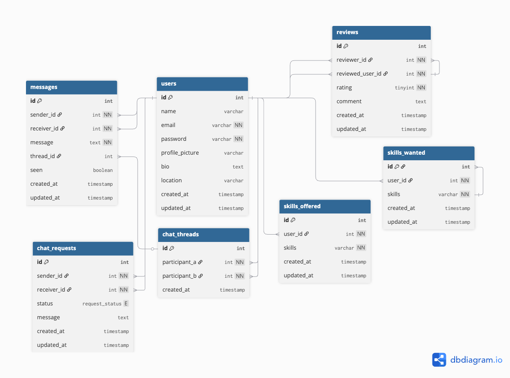
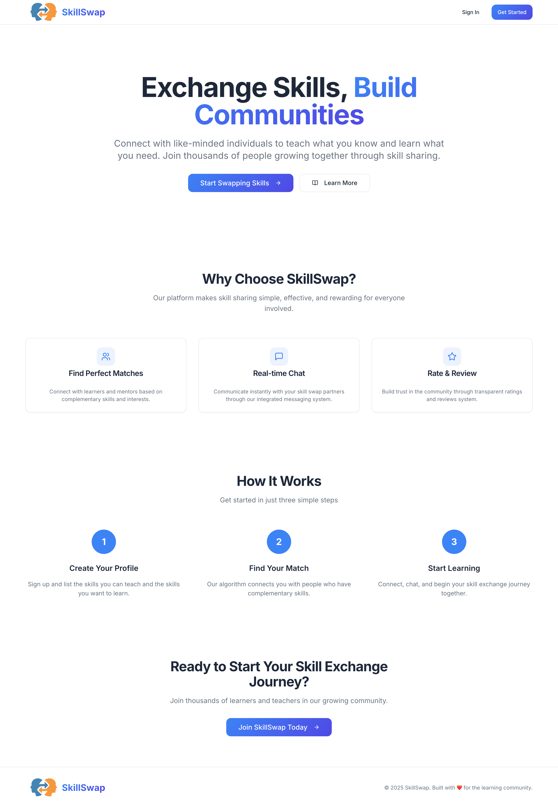
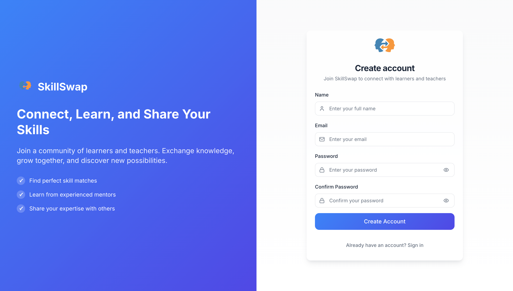
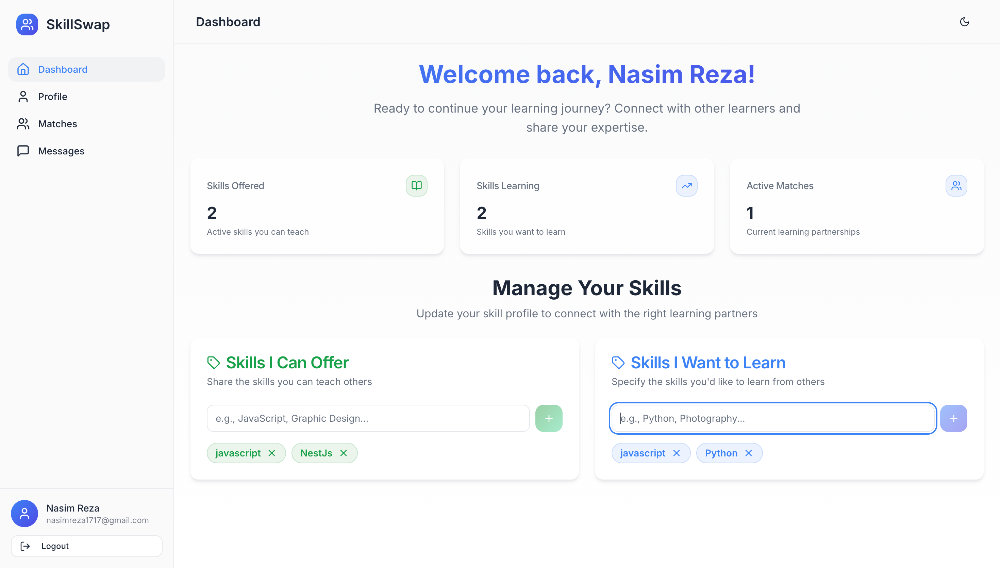
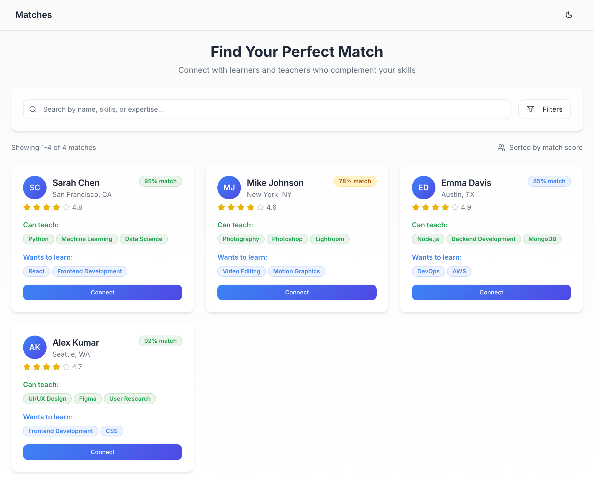
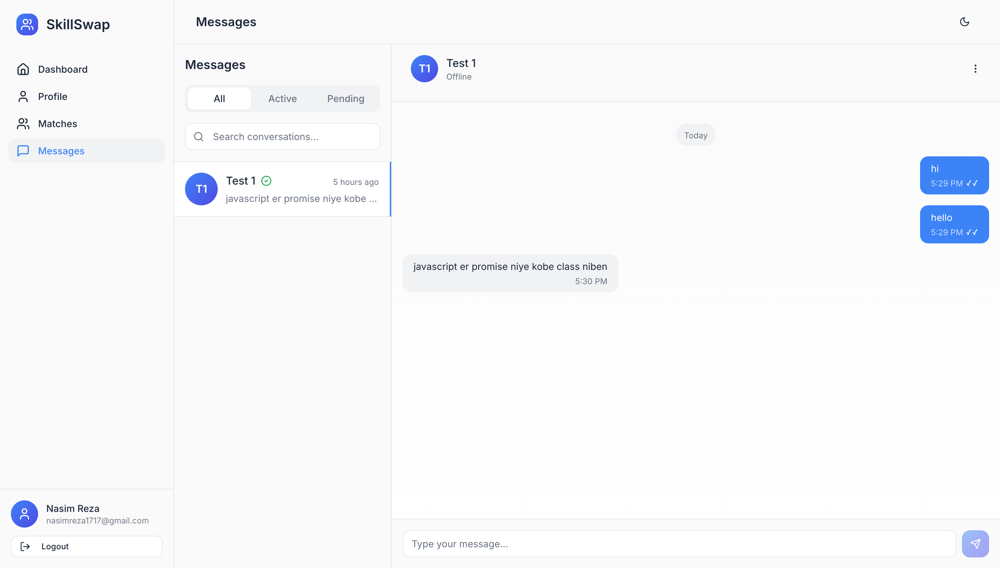
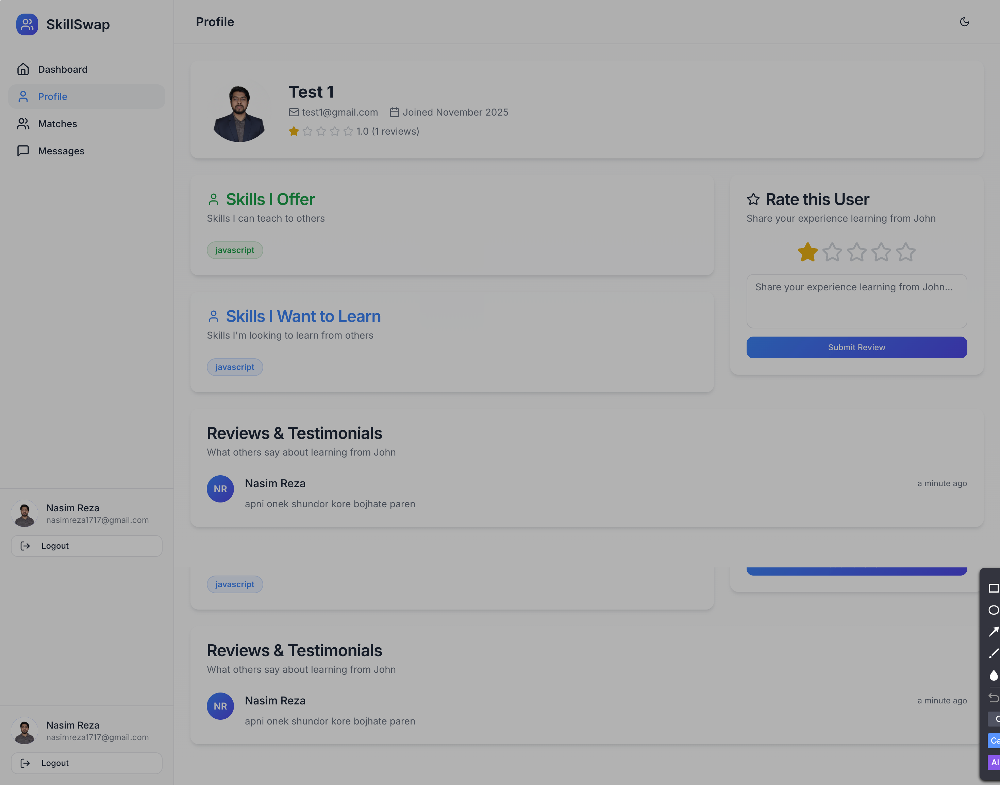

# SkillSwap Platform - Features Documentation

## 📋 Table of Contents

- [Overview](#overview)
- [Technology Stack](#technology-stack)
- [Database Architecture](#database-architecture)
- [Features & Pages](#features--pages)
  - [Landing Page](#landing-page)
  - [Authentication](#authentication)
  - [Dashboard](#dashboard)
  - [Matches](#matches)
  - [Messages](#messages)
  - [Profile](#profile)
- [Key Features](#key-features)

---

## Overview

SkillSwap is a platform that connects people who want to exchange skills. Users can offer skills they're proficient in and request skills they want to learn, then get matched with compatible partners for mutual learning.

### Core Concept

- **Teach what you know** - Share your expertise with others
- **Learn what you want** - Connect with people who can teach you
- **Fair exchange** - Everyone teaches and everyone learns

---

## Technology Stack

### Frontend

- **React 18** - Modern UI library
- **TypeScript** - Type-safe development
- **Vite** - Fast build tool
- **Tailwind CSS** - Utility-first styling
- **shadcn/ui** - Beautiful, accessible components
- **React Router** - Client-side routing
- **Lucide React** - Icon library

### Backend

- **Node.js** - Server runtime environment
- **Express.js** - Web application framework
- **MySQL** - Primary database
- **Authentication** - JWT-based authentication

---

## Database Architecture

The platform uses a comprehensive relational database schema with the following core tables:

### Database ER Diagram


_Complete entity relationship diagram showing all tables and their relationships_

### Core Tables

### Users & Profiles

- **users** – Stores user account and profile information (name, email, password, bio, location, avatar, timestamps)

---

### Skills Management

- **skills_offered** – Skills that a user can teach or offer
- **skills_wanted** – Skills that a user wants to learn

---

### Matching & Communication

- **chat_requests** – Handles permission-based chat requests (pending / accepted)
- **chat_threads** – Represents a conversation channel between two users
- **messages** – Actual chat messages sent between users within a thread

---

### Reviews & Feedback

- **reviews** – Stores ratings and written feedback from one user to another

---

## Features & Pages

### Landing Page


_Modern hero section with call-to-action_

**Features:**

- **Hero Section** – Strong value proposition with “Exchange Skills, Build Communities” messaging
- **Platform Benefits** – Highlights perfect matches, real-time chat, and review system
- **Clear CTAs** – Buttons to start swapping skills or learn more
- **How It Works Section** – Three-step explanation: create profile → find match → start learning
- **Responsive Design** – Fully optimized layout for desktop, tablet, and mobile devices
- **Visual Enhancements** – Gradient highlights, icons, clean typography, and smooth layout structure

**User Actions:**

- **Sign Up** – Create a new account to begin offering or learning skills
- **Login** – Access profile, chat, skills, and personal dashboard
- **Learn More** – Read details about features and how the platform works
- **Start Swapping Skills** – Begin the skill exchange journey directly from the hero section

---

### Authentication


_Secure login and registration interface_

**Features:**

- Unified authentication form
- Toggle between login and signup modes
- Email and password authentication
- Form validation with error messages
- Secure password handling

**User Actions:**

- Create new account
- Login to existing account

---

### Dashboard


_Personalized user dashboard with key metrics_

**Features:**

- Overview of user statistics
- Skill offerings and wanted display
- Active matches display
- Add/edit/remove offered skills
- Add/edit/remove wanted skills

**User Actions:**

- Navigate to matches
- View active matches
- Navigate to messages
- Manage skills
- Quick skill swap initiation

---

### Matches


_Smart matching algorithm connects compatible users_

**Features:**

- **Smart Search**

  - skills offered, or skills wanted
  - Real-time filtering
  - Fuzzy matching

- **Match Cards**

  - User avatar (with initials fallback)
  - Star rating display
  - Location information
  - Match score (0-100%)
  - Color-coded match quality
  - Skills offered (can teach)
  - Skills wanted (wants to learn)
  - Quick connect button

<!-- - **Pagination System**

  - 6 users per page
  - Smart page number display with ellipsis
  - Previous/Next navigation
  - Direct page number selection
  - Shows "X-Y of Z matches"
  - Resets to page 1 on new search -->

- **Empty States**

  - No matches found message
  - Clear search button
  - Helpful suggestions

- **Connection Modal**
  - Confirmation dialog before connecting
  - User summary preview
  - Cancel or confirm actions

**Match Score Algorithm:**

- 90-100%: Excellent match (green badge)
- 80-89%: Good match (primary color)
- 70-79%: Fair match (amber)
- Below 70%: Low match (muted)

**User Actions:**

- Search for compatible users
- Browse paginated results
- View detailed user profiles
- Send connection requests
- Filter by various criteria

---

### Messages


_Real-time messaging with connection management_

**Features:**

- **Conversation List**

  - All conversations organized by status
  - Connection status badges (Pending, Active)
  - Last message preview
  - Timestamp display
  - Unread indicators

- **Tabbed Interface**

  - **All** - View all conversations
  - **Active** - Only accepted connections
  - **Pending** - Incoming requests

- **Chat Interface**

  - Real-time message display
  - Message timestamps
  - Sender/receiver differentiation
  - Auto-scroll to latest
  - Message status indicators

- **Connection Request Actions**

  - Accept buttons for pending requests
  - Disabled input until connection accepted
  - Clear status indicators in header
  - Toast notifications for actions

- **Search & Filter**
  - Search conversations
  - Filter by connection status
  - Sort by recent activity

**User Actions:**

- Accept connection requests
- Send and receive messages
- Switch between conversation tabs
- Search conversations
- View conversation history

---

### Profile


_Comprehensive user profile management_

**Features:**

- **Personal Information**

  - Avatar upload/management
  - Full name
  - Bio/description
  - Location

- **Statistics Display**

  - Skills taught
  - Skills learned
  - Overall rating

- **Reviews Section**
  - Received reviews and ratings
  - Average star rating
  - Feedback from other users
  - Review timestamps

**User Actions:**

- Update profile information
- Upload profile picture
- Edit personal details

---

## Key Features

### 🎯 Smart Matching Algorithm

- Analyzes offered and wanted skills
- Calculates compatibility scores (0-100%)
- Considers location proximity
- Factors in user ratings
- Prioritizes mutual benefit matches

### 💬 Real-time Messaging

- Instant message delivery
- Read receipts
- Message status tracking
- Connection-based conversations
- Organized by status (Active/Pending)

### 🔐 Secure Authentication

- Email and password login
- Session management
- Email verification
- Secure token handling
- Protected routes

### ⭐ Rating & Review System

- 5-star rating scale
- Written feedback
- Match-based reviews
- Public rating display
- Quality assurance

### 📱 Responsive Design

- Mobile-first approach
- Tablet optimization
- Desktop layouts
- Touch-friendly interfaces
- Adaptive navigation

### 🎨 Modern UI/UX

- Clean, intuitive interface
- Consistent design system
- Beautiful animations
- Loading states
- Empty state handling
- Toast notifications

### 🔍 Advanced Search & Filtering

- Real-time search
- Multiple filter criteria
- Sort options
- Clear/reset functionality

### 📊 User Dashboard

- Activity overview
- Quick actions

---

## Future Enhancements

### Planned Features

- Video call integration for teaching sessions
- Calendar/scheduling system
- Skill verification badges
- Achievement system
- Advanced matching filters
- Group learning sessions
- Resource sharing
- Payment integration for premium features
- Mobile app (iOS/Android)
- Social media integration

---

## Getting Started

### Prerequisites

- Node.js 18+ or Bun
- Modern web browser

### Installation

```bash
# Install dependencies
npm install

# Start development server
npm run dev

# Build for production
npm run build
```

### Environment Setup

Enable Express functionality:

- Database operations
- User authentication
- Real-time messaging
- File storage

---

<!-- ## License

[Add your license here] -->

_Documentation last updated: 2025_
